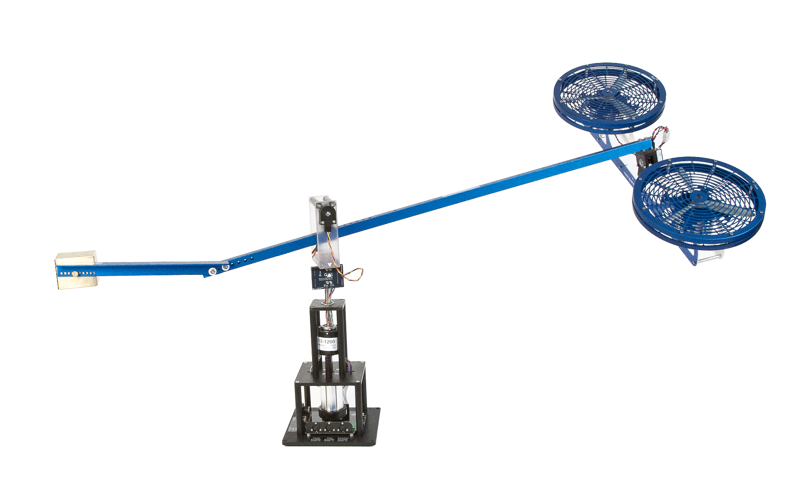

# Modern Control Course Project: 3-DOF Helicopter System

## Overview
This repository contains the implementation and analysis of a 3-DOF (Degree of Freedom) helicopter system for the graduate course "Modern Control" at the University of Tehran. The project encompasses **nonlinear modeling**, **state-space linearization**, **controller/observer design**, **stability analysis**, and **robustness validation** under disturbances and parameter variations. The system is simulated in MATLAB/Simulink, with a focus on achieving fast stabilization, accurate trajectory tracking, and robustness.

  

---

## Project Structure
The final report and implementation follow the structure below:
- **Cover Page**
- **Abstract**
- **Table of Contents** (figures, tables, and equations)
- **Introduction & Assumptions**
- **Nonlinear Modeling** (Euler-Lagrange equations)
- **Linearization** (State-space representation)
- **Stability Analysis** (BIBO, Lyapunov, Marginal)
- **Controller Design** (State feedback, LQR, Integral Tracking, PID)
- **Observer Design** (Full-order and Reduced-order)
- **Robustness Tests** (Parameter variations, external disturbances)
- **Tracking Performance** (Step/sinusoidal inputs)
- **Conclusion**
- **References**
- **Appendices** (MATLAB/Simulink codes, parameter tables, Simulink block diagrams)

---

## Key Features
### 1. **Nonlinear Dynamics & Linearization**
- Derived Euler-Lagrange equations for 3-DOF helicopter dynamics.
- Linearized state-space model around equilibrium:  
  `ẋ = Ax + Bu`, `y = Cx + Du`  
  States: `[ε, ρ, λ, ε̇, ρ̇, λ̇]` (elevation, pitch, travel angles and derivatives).

### 2. **Controller Designs**
- **Pole Placement**: Fast modes (<1 sec settling) and slow modes (<3 sec).
- **LQR Control**: Optimized state feedback with cost matrices `Q` and `R`.
- **Integral Tracking**: Reference tracking for `ε` and `λ` within 1.5 seconds.
- **PID Control**: Improved tracking for sinusoidal inputs.

### 3. **Observer Design**
- **Full-Order Observer**: Estimates all 6 states with convergence <1 sec.
- **Reduced-Order Observer**: Estimates derivatives using only angle measurements.

### 4. **Robustness Validation**
- **Parameter Variations**: ±10% changes in mass and length parameters.
- **External Disturbances**: Force disturbances on the elevation axis.
- **Underactuation**: Simultaneous tracking of two outputs with limited actuators.

### 5. **Simulation Results**
- Achieved **<1 sec settling time** for closed-loop stabilization.
- **Tracking accuracy**: ±0.5° for step references, <2% error for sinusoidal inputs.
- Voltage constraints maintained within ±24V for all scenarios.

  

---

## Key Results
### Stabilization
- **Fast Modes**: Settling time <1 sec for initial deviations (Fig. 4).
- **Slow Modes**: Settling time <3 sec with reduced control effort (Fig. 5).

### Tracking
- **Step Inputs**: `λ = 5u(t)` tracked within 1.5 sec (Fig. 7).
- **Sinusoidal Inputs**: `ε = 10sin(2πt)` tracked with <2% steady-state error (Fig. 19).

### Robustness
- **Parameter Variations**: Maintained stability with ±10% changes (Fig. 8).
- **Disturbance Rejection**: Compensated 1N force on elevation axis (Fig. 10).

### Observers
- **Full-Order Observer**: State estimation convergence <1 sec (Fig. 12-13).
- **Reduced-Order Observer**: Accurate derivative estimation (Fig. 16-17).

  

---

## Tools & Methods
- **MATLAB/Simulink**: Modeling, linearization, and simulation.
- **Control Design**: Pole placement, LQR, PID.
- **Stability Analysis**: Lyapunov, BIBO, eigenvalue analysis.
- **Observer Design**: Luenberger observers (full/reduced order).

